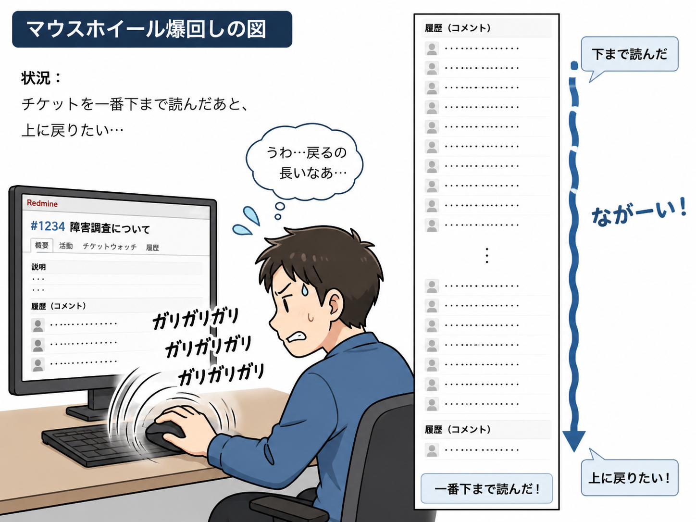
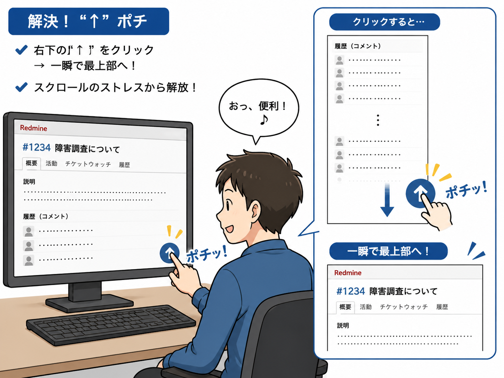

# View Customizeで実装するスクロールトップボタン

チケット画面右下に「↑」ボタンを表示し、クリックでページ上部に戻れる View Customize 用スクリプトです。

（A simple "back to top" button for Redmine using View Customize）

* Redmine 6.1.2 でのみ動作確認済
* JavaScriptを貼るだけ

## Before / After

### Before

長いチケットを読んだあと…



「上に戻りたい…」
→ マウスホイール爆回し

### After



右下の「↑」をポチ！

## 動作環境

* Redmine 6.1.x
* View Customize plugin

## 導入方法

View Customize に以下設定を追加します。

### パスパターン

```text
^/issues/\d+$
```

### 挿入位置

Bottom of all pages

### JavaScript

コードは以下のページを参照ください。

[https://github.com/may0010/redmine-view-customize-scroll-to-top/blob/main/js/scroll-to-top.js](./js/scroll-to-top.js)

## RedmineJapan vol.5 で LT します

RedmineJapan vol.5「ショートスピーチ20連発」で、タイトル「Redmineのチケット画面に“↑”を生やしてみた」で発表します。
https://redmine-japan.org/

## License

MIT
